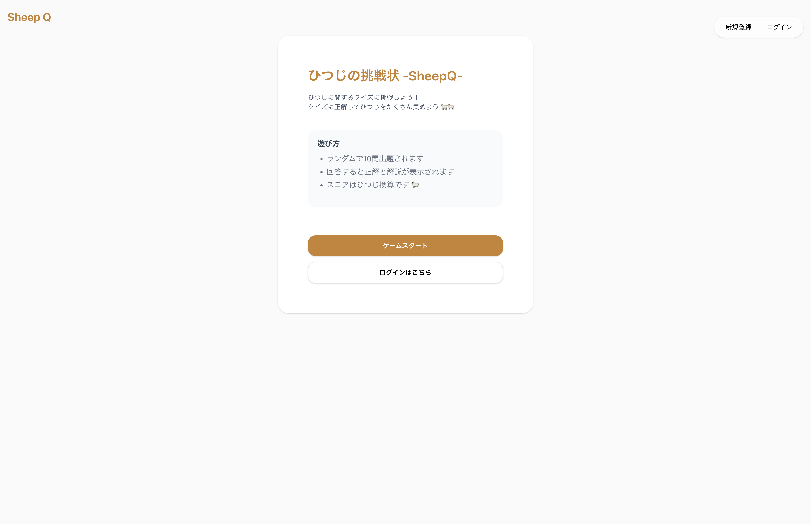
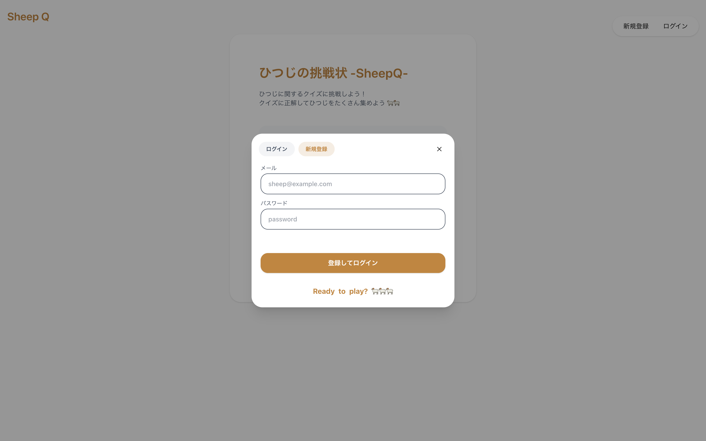
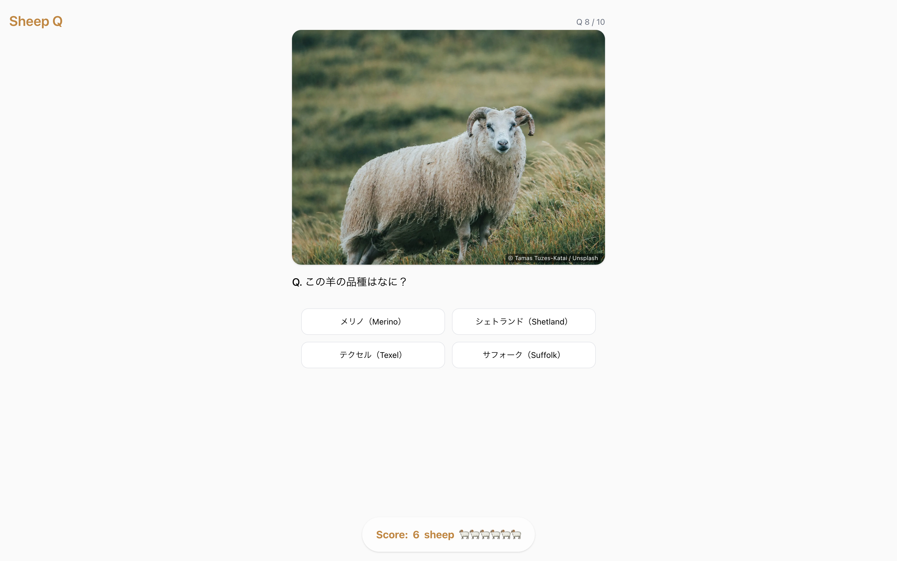
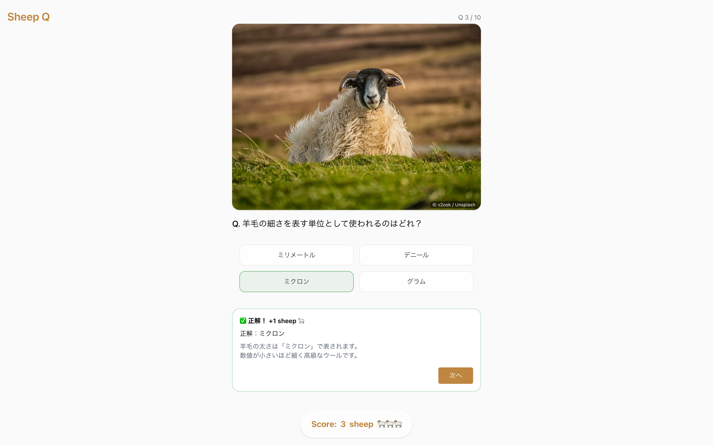
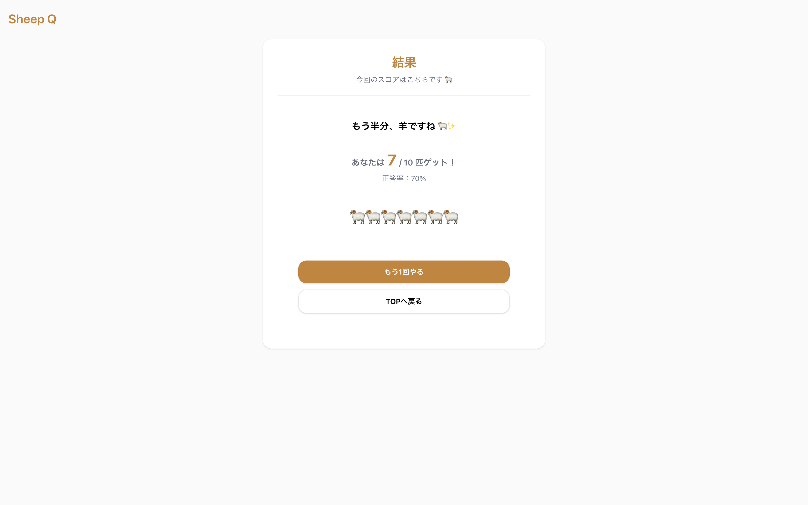
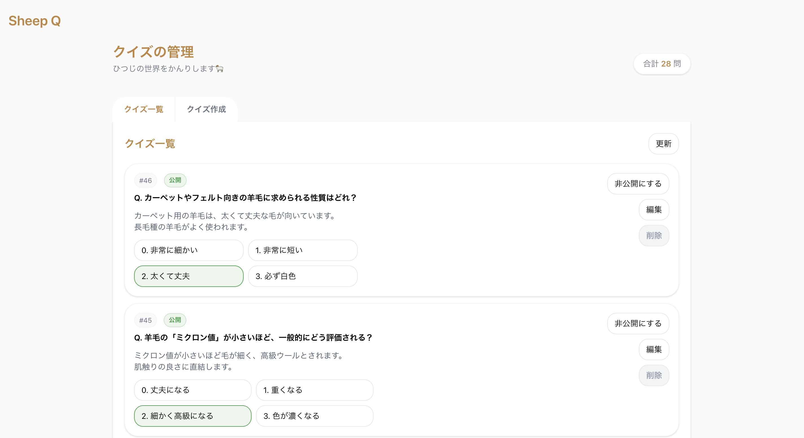
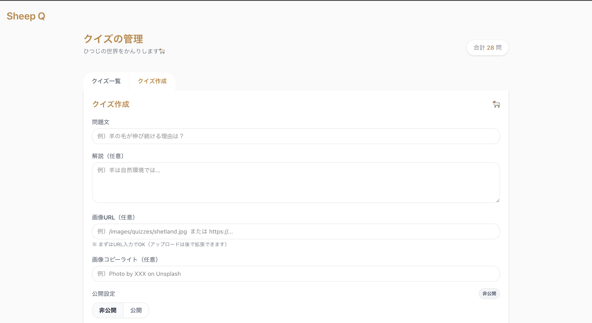

# 🐏 SheepQ（ひつじの挑戦状）

> 羊に関する知識をクイズ形式で楽しく学べるWebアプリ

## 📌 概要

SheepQは、羊に関する知識をクイズ形式で学べるアプリです。

シンプルで直感的な操作で、誰でも迷わず最後まで楽しめる体験を目指して開発しました。

クイズの進行や正誤判定を状態遷移として設計し、

**学習体験と使いやすさの両立**を意識しています。

 

## 📸 デモ

### HOME

アプリのトップ画面。クイズへの導線とログイン導線をシンプルに配置しています。

---

### ログイン

モーダル形式でログイン・新規登録が可能。画面遷移なしで操作できます。

---

### クイズ出題

羊の画像とともに問題が表示され、直感的にクイズに取り組めます。

---

### 回答・フィードバック

選択後すぐに正誤判定と解説を表示し、理解を深められる設計にしています。

---

### 結果画面

スコアと正答率を表示し、達成感と振り返りを促します。

---

### 管理画面（クイズ一覧）

作成したクイズの一覧確認・公開/非公開・編集・削除が可能です。

---

### 管理画面（クイズ作成）

問題文・解説・画像などを入力し、新しいクイズを作成できます。

 

## 🎯 開発背景

単なるクイズアプリではなく、

- 「なぜその答えなのか」を理解できること
- 最後までストレスなく遊べること

を重視し、学習体験として成立する設計を目指しました。

 

## 💡 主な機能

- クイズ出題機能
- 回答・正誤判定
- フィードバック表示（解説付き）
- 管理機能（問題の一覧・編集・削除）

 

## 🧠 工夫した点

### ■ 状態遷移を意識したクイズ設計

クイズの流れ（出題 → 回答 → 判定 → 次の問題）を明確な状態として設計し、

ロジックの整理と拡張性を確保しました。

 

### ■ 学習体験の向上

単純な正誤表示ではなく、

- なぜ正解／不正解なのか
- 補足説明

を表示することで、理解を深められる設計にしました。

 

### ■ データ設計の工夫

問題データをコードから分離し、

将来的にクイズの追加・変更がしやすい構造にしています。

 

### ■ UI/UXの最適化

- 選択肢数を調整し、迷いにくい設計
- 文言の長さを調整し、読みやすさを確保

👉 「考えなくても進める」ではなく

👉 「迷わず考えられる」体験を目指しました

 

## 🏆 成果

- 最初から最後まで迷わず遊べるクイズ体験を実現
- 別テーマにも応用可能な拡張性のある構造を構築

 

## 👥 開発体制

- チーム開発（3人）
- 開発期間：5日間

 

## 👤 担当

- 環境構築（Docker）
- UI設計・実装
- API実装（一覧取得 / 編集 / 削除）
- データベース設計・実装

 

## 🧱 技術スタック

### フロントエンド

- Next.js
- TypeScript
- Tailwind CSS

### バックエンド

- Ruby
- Ruby on Rails

### データベース

- PostgreSQL

### 認証

- Firebase

### インフラ / 開発環境

- Docker

### 開発ツール

- Git / GitHub
- ESLint
- Prettier
- RuboCop

 

## 🔗 リポジトリ

👉 https://github.com/pom11003/SheepQ
